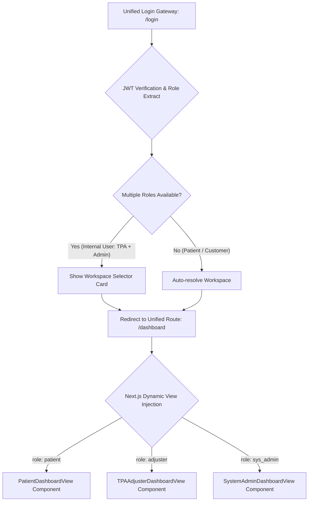

# ClaimGPT — B2C UI/UX Design & Wireframing Specification

> [!NOTE]
> **Enterprise Architecture Document**  
> This specification defines the interface layouts, user flows, and wireframing guidelines for the B2C Patient Reimbursement Portal. It is architected for seamless deployment on **Azure Container Apps** and integration with the **Keycloak** Identity Provider.

---

## 1. Architectural Strategy: Unified Dashboard Routing

To deliver a premium, single-app experience (matching the design patterns of platforms like Stripe and Salesforce) and avoid dated URL structures like `/tpa` or `/admin`, all stakeholders access the application through a unified routing system:



### Key Layout Specifications
* **Single Gateway Access**: All users access the portal via `http://localhost:3000/dashboard`.
* **Dynamic Workspace Injection**: Next.js App Router checks the user's role inside `JWT` credentials and dynamically renders the matching component layer (e.g., `<PatientDashboardView />` for patients) without exposing internal folders in the URL.
* **Access Control & Security**: Next.js `middleware.ts` intercepts requests, blocking patients from calling B2B API endpoints or viewing TPA queues, returning `403 Forbidden` redirects if violated.

---

## 2. Authentication & Patient Registration Wireframe Spec

### A. Patient Sign-Up Fields Layout
To populate the backend patient registry and feed the ensembled risk predictor service, the registration form is organized with strict validation patterns:

| Section | Input Label | HTML Element | Key Constraints | Purpose |
| :--- | :--- | :--- | :--- | :--- |
| **Personal** | Full Name | Text Input | Must match ID Proof exactly | Claim validation checks |
| | Date of Birth | Date Picker | Format: `DD/MM/YYYY` | Predictor: Age-risk normalization |
| | Gender | Dropdown | Options: Male / Female / Other | Demographic database profile |
| **Contact** | Email Address | Email Input | Valid syntax email validation | Login username & notifications |
| | Mobile Number | Text Input | 10-digit numeric constraint | SMS status alerts |
| **Policy** | Insurer Provider | Dropdown | Selection from partner insurers | Insurer brand signature checks |
| | Policy Number | Text Input | Alpha-numeric | ID card regex validation check |
| | Sum Insured | Currency Input| Numeric (INR) | Predictor: Utilization ratios |
| **Security** | Password | Password Input| Min 8 characters, 1 digit, 1 symbol | Secure account creation |
| | Confirm Password| Password Input| Must match Password exactly | Match verification |

### B. Forgot Password Layout
* **Link Placement**: Positioned next to the password input field on the login form.
* **Recovery Screen**: Requests the patient's registered email address.
* **Trigger Action**: Sends a password-reset action to the Keycloak server. Keycloak handles the secure SMTP token verification, allowing the user to safely update their credentials.

---

## 3. Ingress & Upload Staging UI

To handle uploads from multiple local folders without administrative friction, the portal uses a **Staging Area** layout:

```text
+---------------------------------------------------------------------------------+
|  DRAG & DROP FILES HERE OR CLICK TO BROWSE                                      |
|  [ Choose File ] (Supports PDF, JPG, PNG)                                       |
+---------------------------------------------------------------------------------+
|                                                                                 |
|  Staged Documents (Ready for Analysis):                                         |
|  - [X] discharge_summary_final.pdf (4.2 MB)                     [ Remove ]      |
|  - [X] hospital_bill_scanned.jpg (2.1 MB)                        [ Remove ]      |
|                                                                                 |
|  [ + Add More Documents ]  <-- Browse different folders and append files        |
|                                                                                 |
|                                                     [ Begin Claim Analysis ]    |
+---------------------------------------------------------------------------------+
```

### Action Mechanism
* **Append Support**: Patients select files from different directories sequentially. The UI maintains a local list of staged file objects.
* **Process Trigger**: Clicking `[ Begin Claim Analysis ]` packages the staged files into a single multipart request (`POST /ingress/claims`), preventing separate claims from being created for the same encounter.

---

## 4. Real-time Pipeline Progress Stepper

Since OCR processing, layout parsing, and ML scoring can take up to 45 seconds on scanned images, the UI maintains engagement with an **Asynchronous Progress Stepper**:

```text
Claim Analysis in Progress...
[=========================>-------------] 65% Complete

- [✓] Claim ID generated and files staged (Completed)
- [✓] OCR Text Capture: Extracted text from all 5 pages (Completed)
- [⌛] Layout & Table Extraction: Parsing itemized expenses... (Processing Page 3)
- [ ] Coding & Term Standardization: Mapping ICD-10 & CPT codes (Pending)
- [ ] Compliance & Rejection-Risk Scoring (Pending)
```

---

## 5. Dynamic Validation & Missing Document Remediation

The parser uses a **Heuristic Document Classifier** to search extracted texts for matching signatures (e.g. 12-digit spaced Aadhaar card numbers, PAN formats, or partner insurer card layouts). If it detects that critical documents are missing, the UI triggers the **Dynamic Remediation Banner**:

```text
+---------------------------------------------------------------------------------+
| ⚠️ Warning: High Rejection Risk (Rejection Score: 0.74 - HIGH RISK)             |
| Upstream analysis indicates a high likelihood of rejection.                     |
|                                                                                 |
| Identified Missing Documentation:                                               |
|  - [✓] Hospital Bill (Detected)                                                 |
|  - [✓] Discharge Summary (Detected)                                             |
|  - [!] KYC ID Proof (MISSING)       ------------------> [ + Upload ID Proof ]   |
|  - [!] Cancelled Cheque (MISSING)    --------------> [ + Upload Cancelled Cheque ] |
|                                                                                 |
| [ Update & Re-Analyze Claim ]                                                   |
+---------------------------------------------------------------------------------+
```

### Incremental Remediation Flow
1. The patient uploads the missing KYC card using the `[ Upload ID Proof ]` button inside the warning banner.
2. The UI calls `POST /ingress/claims/{claim_id}/documents` to append the file.
3. The backend runs OCR and parsing **only** on the new page, merges the features, and recalculates the risk score in under 2 seconds.

---

## 6. Claims Preview & Auditable Field Editing

Once processing is complete, the dashboard displays the extracted claim data. Because healthcare compliance requires strict tracking of data edits, all field updates include a **Diff-History tooltip**:

```text
[ Patient Name: Ajay Verma                        ] [⏱️ Edited]
                                                     |
                                                     +---> [ Change History ]
                                                           - 2026-07-29 09:41
                                                             Corrected by Patient
                                                             Value: "Ajay Verma" (was: "Ajey Verma")
                                                           - 2026-07-29 09:05
                                                             Parsed by PP-StructureV3
                                                             Value: "Ajey Verma" (Conf: 85%)
```

### Functional Layout Specifications
* **Visual Audit Indicator**: A `⏱️ Edited` badge is placed next to any manually updated field.
* **Collapsible Expense Table**: Lists categorized items (Room Rent, Surgery, Pharmacy) with their parsed amounts and a calculated total sum to help users spot line-item discrepancies.

---

## 7. Mobile-First & Responsive Camera Capture

Since over 80% of B2C claims are uploaded from mobile devices (taking photos of receipts), the portal implements a mobile-responsive camera capture flow:

### A. Mobile Upload Source Selector (Action Sheet)
When a user taps the upload target area on a mobile viewport, it triggers a clean **Bottom Action Sheet** overlay rather than launching the default OS file picker:

```text
+------------------------------------------+
| SELECT DOCUMENT SOURCE                   |
+------------------------------------------+
| [📷] Take Photo / Scan Card              |
|      (Launches camera with edge guide)   |
+------------------------------------------+
| [🖼️] Photo Library                      |
|      (Select existing receipt photo)     |
+------------------------------------------+
| [📁] Browse Files                        |
|      (Select PDF/Doc from device/cloud)  |
+------------------------------------------+
| [ Cancel ]                               |
+------------------------------------------+
```

### B. Mobile Camera Frame Interface
Selecting `Take Photo / Scan Card` opens the in-browser media stream with overlay guidance:

```text
+------------------------------------------+
| [X] Cancel          [⚙️] Settings        |
|                                          |
|  Align receipt/card within the frame     |
|                                          |
|  +------------------------------------+  |
|  | . . . . . . . . . . . . . . . . . .|  |
|  | :                                 :|  |
|  | :        [ Camera Frame ]         :|  |
|  | :                                 :|  |
|  | . . . . . . . . . . . . . . . . . .|  |
|  +------------------------------------+  |
|                                          |
|  [✓] Auto-Crop Guidance: Active          |
|  [✓] Auto-Denoise: Active                |
|                                          |
|               ( Capture )                |
+------------------------------------------+
```

### Mobile Layout Specifications
* **Auto-Crop Guidance**: Client-side canvas edge-detection guides the patient to align the bill or ID card correctly.
* **Local Compression**: Images are compressed locally before upload to prevent network timeouts.
* **Responsive Bottom-Drawer**: The list of staged files collapses into a bottom-drawer sheet on mobile viewports.

---

## 8. Split-Pane Document Auditor UI

For claim verification, the UI implements a Split-Pane layout enabling visual auditing of the parsed data against the source document:

```text
+---------------------------------------------------------------------------------+
| CLAIM REVIEW PANEL                                                              |
+---------------------------------------+-----------------------------------------+
|                                       |                                         |
|  LEFT PANE: ZOOMABLE DOCUMENT VIEWER   |  RIGHT PANE: EDITABLE CLAIMS FORM       |
|                                       |                                         |
|  +---------------------------------+  |  [ Patient Name: Ajay Verma       ] [⏱️]|
|  |  INVOICE #982                   |  |                                         |
|  |                                 |  |  Parsed Bill Line Items:                |
|  |  +---------------------------+  |  |  - Delivery Charges:                    |
|  |  | *Delivery Charges: 16500* |  |  |  [ Description: DELIVERY   ] [16500.00]  |
|  |  +---------------------------+  |  |    *Category: Labour/Delivery           |
|  |                                 |  |                                         |
|  |  Page 1 of 1     [Zoom +/-]     |  |  [ Submit Audited Claim ]               |
|  +---------------------------------+  |                                         |
+---------------------------------------+-----------------------------------------+
```

### Verification Interaction Flow
* **Hover-to-Highlight Linkage**: Hovering over a form input (e.g. the amount field) automatically highlights the corresponding coordinates/bounding box on the document view pane.
* **Scroll-to-View**: Clicking a form field automatically scrolls the document viewport to center on the field's origin coordinates.

---

## 9. Secure Bank Payout & Direct Deposit UI

Reimbursements are paid directly to the patient's bank account. To secure these credentials, the portal includes a payout details manager:

### A. Bank Account Inputs & Constraints

| Input Field | HTML Element | Key Constraints | Validation Rule |
| :--- | :--- | :--- | :--- |
| **Account Holder Name** | Text Input | Must match ID Proof | Regex: `/^[A-Za-z\s]+$/` |
| **IFSC Code** | Text Input | 11-digit alpha-numeric | Regex: `/^[A-Z]{4}0[A-Z0-9]{6}$/` |
| **Account Number** | Password Input | 9 to 18 numeric digits | Obscured by default |
| **Confirm Account Number**| Text Input | Must match exactly | Match check on blur |
| **Cancelled Cheque / Passbook** | File Uploader | PDF, PNG, or JPG | Must be uploaded if editing |

---

## 10. Post-Analysis Claim Processing Timeline

Once a claim is analyzed and submitted, patients track their real-time claim status through the **TPA Reimbursement Stages Timeline**:

```text
Claim Status: UNDER ADJUSTMENT REVIEW

  [✓] Claim Created & Docs Uploaded ------------------ (2026-07-29 09:05)
  [✓] AI Parsing & Audit Validation Complete ---------- (2026-07-29 09:12)
  [●] TPA Adjuster Verification ----------------------- (In Progress)
  [ ] Claim Approval & Admissible Amount Finalized ---- (Pending)
  [ ] Bank Payout Disbursed --------------------------- (Pending)
```

### Actionable States
* **Under Adjustment Review**: The adjuster is comparing items against the policy terms.
* **Approved**: Displays the final approved amount and links to download the digital claim sheet.
* **Settled**: Confirms payout transaction ID and date.


