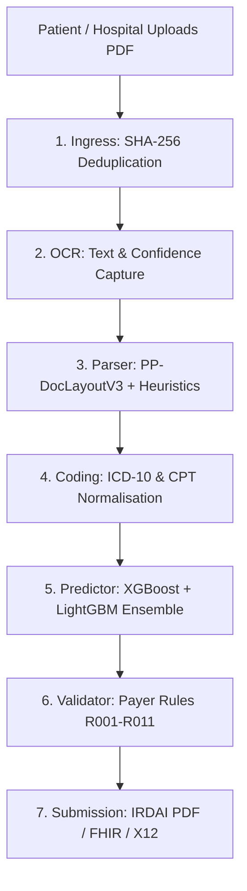

# ClaimGPT — Business Purpose, Stakeholders & Pitch Document

> [!IMPORTANT]
> This document details the exact business purpose, use cases, stakeholders, and technical architecture of **ClaimGPT**, adjusted to reflect the exact reality of the codebase.

---

## 1. Executive Pitch (30-45 seconds)

**ClaimGPT** is an AI-powered claims intelligence platform for health insurance workflows. It converts raw medical documents into structured, auditable claim decisions with minimal manual effort.

Today, claims processing teams lose time in three major areas:
1. **Unstructured Documents**: Reading and copy-pasting from chaotic hospital bills and discharge summaries.
2. **Cross-Document Consistency**: Manually verifying that diagnoses, procedures, bill line items, and policy rules align.
3. **Payer-Ready Packets**: Structuring and exporting claim files with verifiable audit trails.

ClaimGPT solves this by automating document understanding, medical coding suggestions, rejection risk scoring, rule validation, and submission packaging in one unified, orchestrated pipeline.

---

## 2. Core Value Proposition & Use Cases

In standard claim operations, healthcare data arrives as unstructured, noisy files (discharge summaries, hospital bills, pharmacy invoices, lab reports). ClaimGPT does not just extract text; it performs **semantic cross-document reasoning** and **automated decision support**:

* ⚡ **Operational Turnaround**: Shrinks claim review cycles from hours to seconds.
* 🏥 **Pre-submission Scrubbing**: Empowers hospital revenue cycle teams to check claims against rules and predict rejection risks before submitting to TPAs/payers.
* 🔍 **Revenue Leakage Protection**: Automatically merges multiline expense rows and flags duplicate or unbundled codes.
* 🛡️ **Traceability**: Tracks every extracted data field directly back to its source token, bounding box coordinates, and page.

---

## 3. End-to-End Pipeline Flow

### 1. Upload & Intake
* **Action**: User uploads one or multiple clinical files.
* **Mechanism**: The ingress service hashes each file (SHA-256). If the hash is already present, it blocks reprocessing to prevent redundant compute.

### 2. OCR & Text Capture
* **Action**: Extracts text blocks from PDF/image pages, storing bounding boxes and character confidence indexes.

### 3. Parsing & Structuring
* **Action**: Identifies the document type and extracts clinical entities and table items.
* **Mechanism**: Employs `PP-DocLayoutV3` for layout-aware table region segmentation and falls back to coordinate geometry/heuristics when tables are missed.

### 4. Medical Coding Support
* **Action**: Standardizes free-text clinical terms into formal codes.
* **Mechanism**: Suggests matching **ICD-10** (diagnoses) and **CPT** (procedures) codes with confidence ratings.

### 5. Risk Prediction
* **Action**: Evaluates the claim's likelihood of rejection.
* **Mechanism**: Compiles 23 clinical and financial feature dimensions, running them through an ensembled **XGBoost + LightGBM** model.

### 6. Rule Validation
* **Action**: Performs consistency checks across extracted fields.
* **Mechanism**: Evaluates the claim against 11 payer validation rules (R001–R011), assigning severity labels (`INFO`, `WARN`, `BLOCKER`).

### 7. Workflow Orchestration
* **Action**: Manages async execution and job retries.
* **Mechanism**: Governed by Celery workers fanning out across Redis queues.

### 8. Reporting & Submission
* **Action**: Packages parsed claims into regulator-ready exports.
* **Mechanism**: Produces interactive fillable PDF standard forms (e.g., India's **IRDAI** reimbursement form) or exports structured FHIR R4 JSON and X12 837P files.

### 9. Chat & Explainability Layer
* **Action**: Allows handlers to query claim files using natural language.
* **Mechanism**: Retrieves parsed metadata and OCR evidence to answer claim-specific questions in chat.

---

## 4. Microservice Breakdown

The application is structured as a decoupled, service-based architecture:

| Service | Exact Codebase Implementation & Tech | Business Value |
| :--- | :--- | :--- |
| **Ingress** | FastAPI REST endpoints; computes SHA-256 content hashes to enforce upload idempotency. | Secures intake gateway and prevents duplicates. |
| **OCR** | Processes PDF/image rendering; tracks raw token coordinates. | Standardizes unstructured input documents. |
| **Parser** | Utilizes `PP-DocLayoutV3` (PaddleX) to identify tables. Falls back to precise geometric column/row grouping algorithms. | Reconstructs complex tables (such as Pharmacy or Lab expenses) with multiline continuation merging. |
| **Coding** | Performs dictionary search and vector retrieval (FAISS/BM25) to map clinical terms to codes. | Replaces manual book lookups for coders. |
| **Predictor** | Loads pre-trained models (`xgb_rejection.json` and `lgbm_rejection.txt`) to execute an ensembled rejection classification. | Flags high-risk claims for manual audit priority. |
| **Validator** | Evaluates a suite of 11 declarative rules (R001–R011) checking for amount discrepancies or missing attributes. | Prevents sending incomplete packets to the payer. |
| **Workflow** | Orchestrates tasks asynchronously via Celery workers (`parser_queue`, `ocr_queue`, etc.) backed by Redis. | Provides scale, task isolation, and job retry support. |
| **Submission** | Translates validated claims into FHIR schemas, X12 forms, or generates a fillable IRDAI PDF. | Automates standard data exchange. |
| **Chat** | Leverages RAG over the claim's text tokens with LangGraph-orchestrated sessions. | Allows adjusters to ask conversational questions about files. |
| **Shared Libs** | Contains shared Pydantic schemas, Alembic migrations, database models, and common field mapping utilities. | Guarantees data type contract sanity across services. |

> [!WARNING]
> **Important Technical Note on Fraud ML vs. Heuristics**:
> While `services/fraud/app/ml.py` is written to load an `IsolationForest` model from `models/fraud_isoforest.joblib`, this model file is **not checked into the repository**. 
> Thus, the fraud service in the active pipeline runs its **heuristic fallback (`heuristic-anomaly-v1`)**, calculating a deterministic anomaly proxy score in `[0, 1]` based on specific billing ratios (e.g., ICU ratio, amount log, claim-to-insured ratio).

---

## 5. Technology Stack Summary

* **APIs & Web Gateway**: FastAPI (Python)
* **Async Workers**: Celery + Redis
* **Database**: PostgreSQL (State logging, claims history, audit logs)
* **Migrations**: Alembic
* **Document Layout**: PP-DocLayoutV3 (model-assisted) + coordinate-grid table reconstructor (heuristics)
* **Machine Learning**: XGBoost + LightGBM (rejection risk scoring) + Heuristic scoring fallback (fraud detection)
* **Frontend**: Next.js / HTML (Web Admin Console and B2C intake upload dashboard)
* **Infrastructure**: Docker & Docker Compose configurations

---

## 6. Stakeholders Map

### 🏥 Hospital Providers (B2B)
* **Hospital Coder / Revenue Cycle Team**: Runs "pre-submission scrubbing" on patient bills. Checks validator outcomes and corrects coding flags to ensure clean submissions.

### 🛡️ Third Party Administrators (TPAs) & Insurers (B2B)
* **TPA Adjuster / Claims Reviewer**: Principal user of the admin portal. Conducts audits, executes natural-language Q&A checks on the claim, and applies edits via the diff view.
* **SIU (Special Investigation Unit) Investigator**: Reviews claims flagged with suspicious outlier scores (using heuristic fraud ratios).
* **Compliance Auditor**: Reviews the PostgreSQL `audit_log` records to verify every state transition and manual override.

### 👥 Consumers (B2C)
* **Patient / Policyholder**: Uploads bills and claims directly via the consumer portal. Generates regulatory-ready claim files without hospital back-office assistance.
