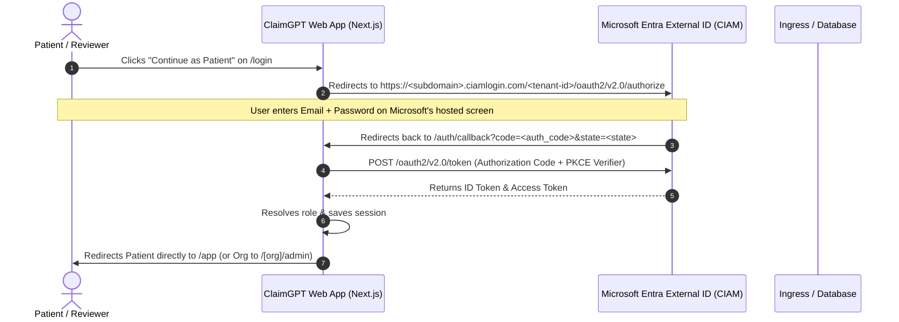

# Microsoft Entra External ID (CIAM) Setup Guide

This guide walks you step-by-step through configuring **Microsoft Entra External ID (CIAM)** in the Microsoft Entra Admin Center / Azure Portal, registering your ClaimGPT Web Application, and obtaining your exact environment variable credentials.

---

## 📋 Table of Contents
1. [Authentication Flow Architecture](#1-authentication-flow-architecture)
2. [Overview of Environment Variables](#2-overview-of-environment-variables)
3. [Step 1: Create an External Tenant (CIAM)](#step-1-create-an-external-tenant-ciam)
4. [Step 2: Register the ClaimGPT Single-Page Application (SPA)](#step-2-register-the-claimgpt-single-page-application-spa)
5. [Step 3: Configure Authentication & Redirect URIs](#step-3-configure-authentication--redirect-uris)
6. [Step 4: Create User Flows (Sign-Up & Sign-In)](#step-4-create-user-flows-sign-up--sign-in)
7. [Step 5: Collect and Map Your Credentials to `.env`](#step-5-collect-and-map-your-credentials-to-env)
8. [Troubleshooting & Verification](#troubleshooting--verification)

---

## 1. Authentication Flow Architecture



---

## 2. Overview of Environment Variables

In `claimgpt-designs/.env` (and `.env.example`), configure:

| Variable | Description | Example Value |
| :--- | :--- | :--- |
| `NEXT_PUBLIC_ENABLE_ENTRA_ID` | Master feature flag. Set to `true` to use Entra External ID login, or `false` for local fallback. | `true` |
| `NEXT_PUBLIC_AUTH_PROVIDER` | Identifies active identity provider. Set to `entra`. | `entra` |
| `NEXT_PUBLIC_ENTRA_CLIENT_ID` | The **Application (client) ID** of your registered app in the external tenant. | `e4b3c2a1-0000-0000-0000-123456789abc` |
| `NEXT_PUBLIC_ENTRA_TENANT_ID` | The **Directory (tenant) ID** of your external tenant. | `a1b2c3d4-0000-0000-0000-abcdef123456` |
| `NEXT_PUBLIC_ENTRA_SUBDOMAIN` | The initial domain prefix of your external tenant (`<subdomain>.ciamlogin.com`). | `claimgptauth` |
| `NEXT_PUBLIC_ENTRA_AUTHORITY` | The base authority URL. | `https://claimgptauth.ciamlogin.com/a1b2c3d4-0000-0000-0000-abcdef123456` |
| `NEXT_PUBLIC_ENTRA_REDIRECT_URI` | The URL Entra ID returns the authorization code to after login. | `http://localhost:3001/auth/callback` |
| `NEXT_PUBLIC_ENTRA_SCOPES` | The OpenID Connect permission scopes requested from Entra ID. | `openid profile email offline_access` |

---

## Step 1: Create an External Tenant (CIAM)

> [!NOTE]
> Microsoft Entra External ID requires a dedicated external tenant configured for customer scenarios.

1. Sign in to the [Microsoft Entra Admin Center](https://entra.microsoft.com/) or [Azure Portal](https://portal.azure.com/).
2. In the left navigation, select **Overview** > **Manage tenants** (or search for *Tenants*).
3. Click **+ Create**.
4. Under **Tenant type**, select **Customer (Microsoft Entra External ID)**.
5. Click **Next: Configuration**.
6. Set the tenant details:
   - **Tenant name**: e.g. `ClaimGPT CIAM` or `Star Health Auth`.
   - **Initial domain name**: Choose a unique subdomain (e.g. `claimgptauth`).
     * *This value is your `NEXT_PUBLIC_ENTRA_SUBDOMAIN`.*
   - **Location**: Select your region (e.g. `India`, `United States`, or `Europe`).
7. Click **Review + create** > **Create**.
8. Once created, click **Switch to tenant** from the top directory filter.

---

## Step 2: Register the ClaimGPT Single-Page Application (SPA)

Inside your new external tenant:

1. In the left menu, navigate to **Applications** > **App registrations**.
2. Click **+ New registration**.
3. Fill in:
   - **Name**: `ClaimGPT Web App`.
   - **Supported account types**: Select **Accounts in this organizational directory only (Customer accounts)**.
   - **Redirect URI**:
     - Platform: Select **Single-page application (SPA)**.
     - URI: `http://localhost:3001/auth/callback` (and your production domain).
4. Click **Register**.

---

## Step 3: Configure Authentication & Redirect URIs

1. In your registered app, click **Authentication** in the left menu.
2. Under **Single-page application**:
   - Ensure `http://localhost:3001/auth/callback` is present.
3. Under **Implicit grant and hybrid flows**:
   - Check **ID tokens (used for implicit and hybrid flows)**.
   - Check **Access tokens**.
4. Click **Save**.

---

## Step 4: Create User Flows (Sign-Up & Sign-In)

1. In the left navigation, go to **External Identities** > **User flows**.
2. Click **+ New user flow**.
3. Select **Sign up and sign in**.
4. Configure the flow:
   - **Name**: `SignUpSignIn` (this creates `B2X_1_SignUpSignIn`).
   - **Identity providers**:
     - Check **Email with password** (or **Email one-time passcode**).
     - *(Optional)* Check **Google** or **Microsoft Account** if social login is desired.
   - **User attributes**:
     - Check **Given Name** (First Name), **Surname** (Last Name), and **Email Address**.
5. Click **Create**.
6. In the user flow details, select **Applications** under **Customize** and associate your `ClaimGPT Web App`.

---

## Step 5: Collect and Map Your Credentials to `.env`

From **Applications** > **App registrations** > Click **ClaimGPT Web App** > **Overview**:

1. **Application (client) ID**: Copy GUID to `NEXT_PUBLIC_ENTRA_CLIENT_ID`.
2. **Directory (tenant) ID**: Copy GUID to `NEXT_PUBLIC_ENTRA_TENANT_ID`.
3. **Subdomain**: Your initial domain prefix (e.g. `claimgptauth`).
4. **Authority URL**:
   - `https://<NEXT_PUBLIC_ENTRA_SUBDOMAIN>.ciamlogin.com/<NEXT_PUBLIC_ENTRA_TENANT_ID>`

### Complete Example Configuration (`claimgpt-designs/.env`):

```env
# Enable Entra External ID Login
NEXT_PUBLIC_ENABLE_ENTRA_ID=true
NEXT_PUBLIC_AUTH_PROVIDER=entra

# Entra External ID Tenant Settings
NEXT_PUBLIC_ENTRA_CLIENT_ID=e4b3c2a1-1234-5678-abcd-000000000000
NEXT_PUBLIC_ENTRA_TENANT_ID=a1b2c3d4-5678-90ab-cdef-111111111111
NEXT_PUBLIC_ENTRA_SUBDOMAIN=claimgptauth
NEXT_PUBLIC_ENTRA_AUTHORITY=https://claimgptauth.ciamlogin.com/a1b2c3d4-5678-90ab-cdef-111111111111
NEXT_PUBLIC_ENTRA_REDIRECT_URI=http://localhost:3001/auth/callback
NEXT_PUBLIC_ENTRA_SCOPES=openid profile email offline_access
```

---

## Troubleshooting & Verification

| Issue | Resolution |
| :--- | :--- |
| **`AADSTS50011: The reply URL specified in the request does not match...`** | Ensure `http://localhost:3001/auth/callback` exactly matches the Redirect URI in App Registration > Authentication. |
| **`CORS error on token request`** | Ensure the platform in Azure is configured as **Single-page application (SPA)**. |
| **Local Testing without Entra ID** | Set `NEXT_PUBLIC_ENABLE_ENTRA_ID=false` in `.env` or click *"Switch to Local Password Login"* on the login page. |
